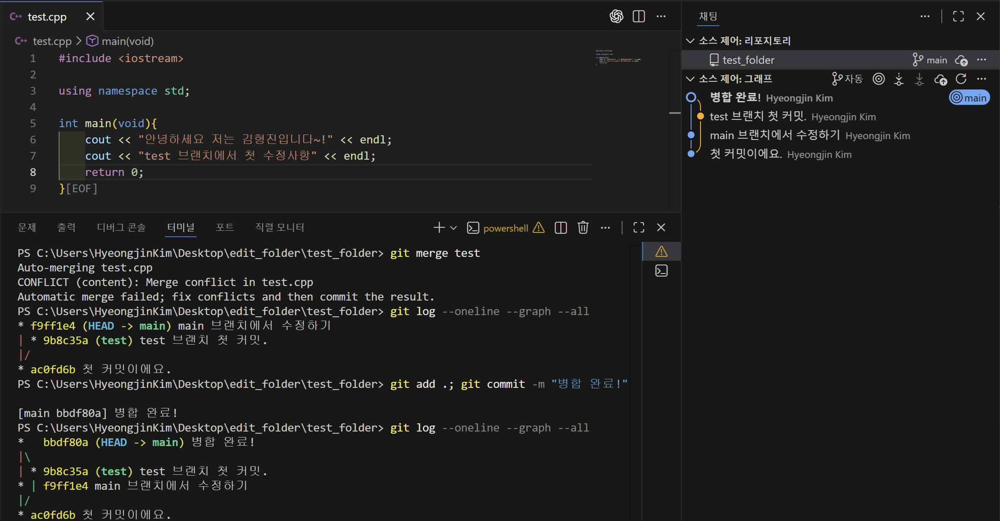

# Practice 답안 - 김형진(임베디드시스템공학과)

---

## 문제 1. 브랜치 분기/병합 및 로그 그래프 캡처
캡처 첨부
- 

---

## 문제 2. Fork 후 자기소개 문서 제출 및 PR 병합

자기소개(필수 사항)
- 이름: 김형진
- 학과: 임베디드시스템공학과
- 관심 분야: ROS2, 자율주행, 임베디드
- 하고 싶은 것: 센서 융합 기반 주행/제어 프로젝트 경험 쌓기

PR 정보(예시)
- PR Title: `[opensw cont/김형진] 자기소개 문서를 제출합니다.` 와 같이 제출하세요.
- 링크: https://github.com/EliseEgkart/ROS2_autonomous_driving_education_UNITA_2026/pull/1

---

## 문제 3. Issue 생성 + PR 승인 후 병합 (컨벤션 준수)

PR 정보(예시, 수업과 내용이 상이함. 수업 내용을 기준으로 작성 할 것)
- 링크:  https://github.com/EliseEgkart/github_tutorial_UNITA_2026/pull/7