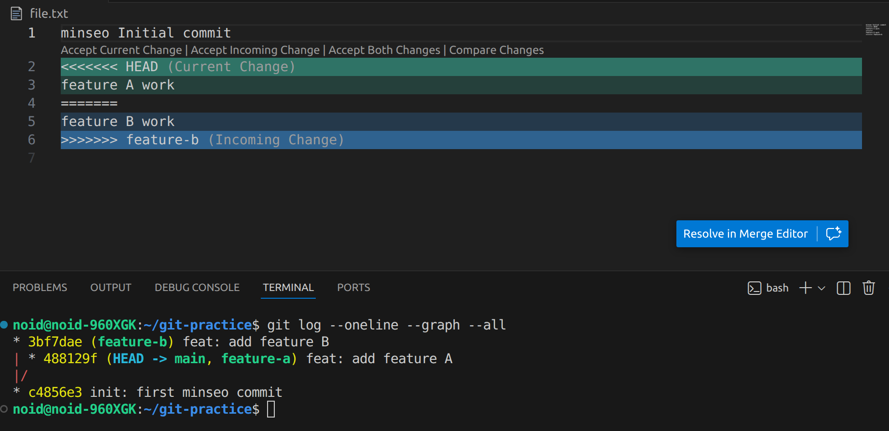

# Practice 답안 - 김민서(임베디드시스템공학과)
---
## 문제 1. 브랜치 분기/병합 및 로그 그래프 캡처
- 캡처: 
---
## 문제 2. Fork 후 자기소개 문서 제출 및 PR 병합
### 자기소개
- 이름: 김민서
- 학과: 임베디드시스템공학과
- 관심 분야: ROS2, 임베디드, 자율주행, 하드웨어
- 목표: 센서 융합 기반 주행/제어 프로젝트 경험 쌓기
### PR 정보
- 링크: https://github.com/EliseEgkart/github_tutorial/pull/111#issue-3843480839
---
## 문제 3. Issue 생성 + PR 승인 후 병합
### Issue 정보
- 링크: https://github.com/EliseEgkart/github_tutorial/issues/112
### PR 정보
- 링크: 