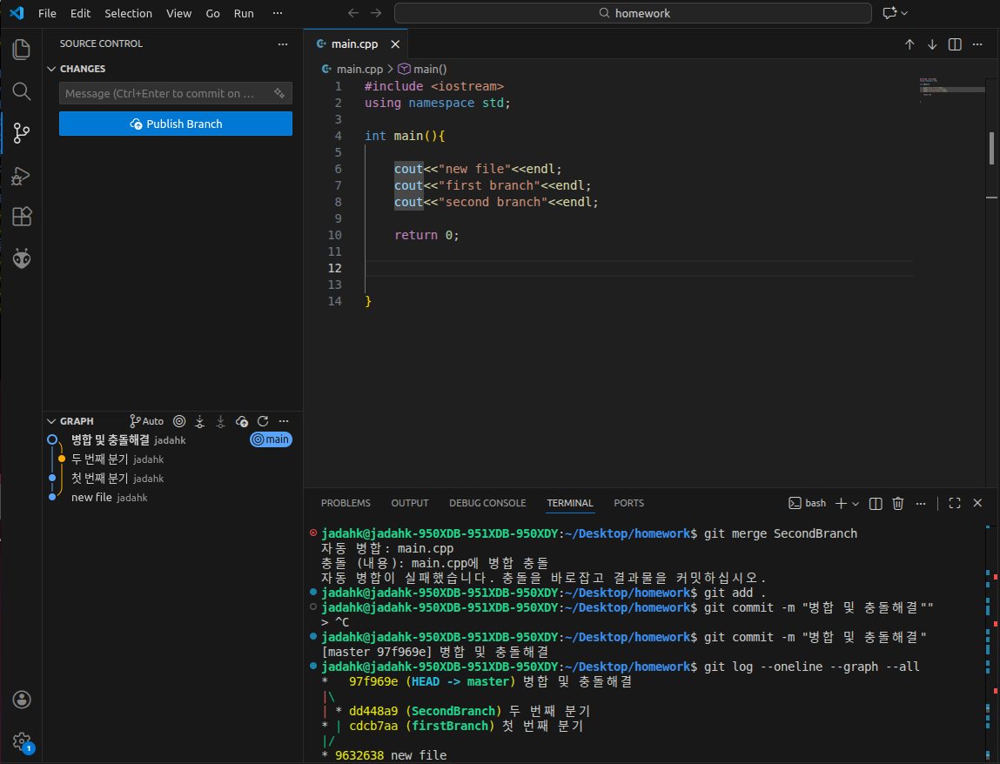

# Practice 답안 - 장동혁(컴퓨터공학부)

---

## 문제 1. 브랜치 분기/병합 및 로그 그래프 캡처
- 

---

## 문제 2. Fork 후 자기소개 문서 제출 및 PR 병합

자기소개
- 이름: 장동혁
- 학과: 컴퓨터공학부
- 관심 분야: ROS2, 자율주행, 컴퓨터 시스템
- 하고 싶은 것: 지율주행 관련 알고리즘 구현(경로생성, 주차 등)